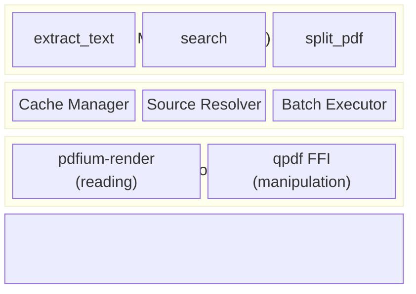

# 📄 PDF MCP Server

A high-performance [MCP](https://modelcontextprotocol.io/) server for PDF processing, built in Rust.

[](https://opensource.org/licenses/Apache-2.0)
[](https://github.com/paradyno/pdf-mcp-server/actions/workflows/ci.yml)
[](https://codecov.io/gh/paradyno/pdf-mcp-server)

Give your AI agents powerful PDF capabilities — extract text, search, split, merge, encrypt, and more. All dependencies are Apache 2.0 licensed, keeping your project clean and permissive.

## ✨ Features

| Category | Tools |
|----------|-------|
| 📖 **Reading** | `extract_text` · `extract_metadata` · `extract_outline` · `extract_annotations` · `extract_links` · `extract_form_fields` |
| 🔍 **Search & Discovery** | `search` · `list_pdfs` · `get_page_info` · `summarize_structure` |
| 🖼️ **Media** | Image extraction (via `extract_text`) · `convert_page_to_image` |
| ✂️ **Manipulation** | `split_pdf` · `merge_pdfs` · `compress_pdf` · `fill_form` |
| 🔒 **Security** | `protect_pdf` · `unprotect_pdf` · Password-protected PDF support |
| 📦 **Resources** | Expose PDFs as MCP Resources for direct client access |
| ⚡ **Performance** | Batch processing · LRU caching · Operation chaining via cache keys |

## 🚀 Installation

### npm (Recommended)

```bash
npm install -g @paradyno/pdf-mcp-server
```

### Pre-built Binaries

Download from [GitHub Releases](https://github.com/paradyno/pdf-mcp-server/releases):

| Platform | x86_64 | ARM64 |
|----------|--------|-------|
| 🐧 Linux | `pdf-mcp-server-linux-x64` | `pdf-mcp-server-linux-arm64` |
| 🍎 macOS | `pdf-mcp-server-darwin-x64` | `pdf-mcp-server-darwin-arm64` |
| 🪟 Windows | `pdf-mcp-server-windows-x64.exe` | — |

### From Source

```bash
cargo install --git https://github.com/paradyno/pdf-mcp-server
```

## ⚙️ Configuration

### Claude Desktop

Add to your `claude_desktop_config.json`:
- **macOS:** `~/Library/Application Support/Claude/claude_desktop_config.json`
- **Windows:** `%APPDATA%\Claude\claude_desktop_config.json`

```json
{
  "mcpServers": {
    "pdf": {
      "command": "npx",
      "args": ["@paradyno/pdf-mcp-server"]
    }
  }
}
```

### Claude Code

```bash
claude mcp add pdf -- npx @paradyno/pdf-mcp-server
```

### VS Code

```json
{
  "mcp.servers": {
    "pdf": {
      "command": "npx",
      "args": ["@paradyno/pdf-mcp-server"]
    }
  }
}
```

## 🛠️ Tools

### Source Types

All tools accept PDF sources in multiple formats:

```json
{ "path": "/documents/file.pdf" }
{ "base64": "JVBERi0xLjQK..." }
{ "url": "https://example.com/document.pdf" }
{ "cache_key": "abc123" }
```

---

### 📖 `extract_text`

Extract text content with LLM-optimized formatting (paragraph detection, multi-column reordering, watermark removal).

<details>
<summary>Example & Parameters</summary>

```json
{
  "sources": [{ "path": "/documents/report.pdf" }],
  "pages": "1-10",
  "include_metadata": true
}
```

| Parameter | Type | Required | Default | Description |
|-----------|------|----------|---------|-------------|
| `sources` | array | Yes | — | PDF sources |
| `pages` | string | No | all | Page selection (e.g., `"1-5,10,15-20"`) |
| `include_metadata` | boolean | No | true | Include PDF metadata |
| `include_images` | boolean | No | false | Include extracted images (base64 PNG) |
| `password` | string | No | — | PDF password if encrypted |
| `cache` | boolean | No | false | Enable caching |

</details>

### 📖 `extract_outline`

Extract PDF bookmarks / table of contents.

<details>
<summary>Example, Parameters & Response</summary>

```json
{
  "sources": [{ "path": "/documents/book.pdf" }]
}
```

| Parameter | Type | Required | Default | Description |
|-----------|------|----------|---------|-------------|
| `sources` | array | Yes | — | PDF sources |
| `password` | string | No | — | PDF password if encrypted |
| `cache` | boolean | No | false | Enable caching |

**Response:**

```json
{
  "results": [{
    "source": "/documents/book.pdf",
    "outline": [
      {
        "title": "Chapter 1: Introduction",
        "page": 1,
        "children": [
          { "title": "1.1 Background", "page": 3, "children": [] }
        ]
      }
    ]
  }]
}
```

</details>

### 📖 `extract_metadata`

Extract PDF metadata (author, title, dates, etc.) without loading full content.

<details>
<summary>Example & Parameters</summary>

```json
{
  "sources": [{ "path": "/documents/report.pdf" }]
}
```

| Parameter | Type | Required | Default | Description |
|-----------|------|----------|---------|-------------|
| `sources` | array | Yes | — | PDF sources |
| `password` | string | No | — | PDF password if encrypted |
| `cache` | boolean | No | false | Enable caching |

</details>

### 📖 `extract_annotations`

Extract highlights, comments, underlines, and other annotations.

<details>
<summary>Example & Parameters</summary>

```json
{
  "sources": [{ "path": "/documents/report.pdf" }],
  "annotation_types": ["highlight", "text"],
  "pages": "1-5"
}
```

| Parameter | Type | Required | Default | Description |
|-----------|------|----------|---------|-------------|
| `sources` | array | Yes | — | PDF sources |
| `annotation_types` | array | No | all | Filter by types (highlight, underline, text, etc.) |
| `pages` | string | No | all | Page selection |
| `password` | string | No | — | PDF password if encrypted |
| `cache` | boolean | No | false | Enable caching |

</details>

### 📖 `extract_links`

Extract hyperlinks and internal page navigation links.

<details>
<summary>Example, Parameters & Response</summary>

```json
{
  "sources": [{ "path": "/documents/paper.pdf" }],
  "pages": "1-10"
}
```

| Parameter | Type | Required | Default | Description |
|-----------|------|----------|---------|-------------|
| `sources` | array | Yes | — | PDF sources |
| `pages` | string | No | all | Page selection |
| `password` | string | No | — | PDF password if encrypted |
| `cache` | boolean | No | false | Enable caching |

**Response:**

```json
{
  "results": [{
    "source": "/documents/paper.pdf",
    "links": [
      { "page": 1, "url": "https://example.com", "text": "Click here" },
      { "page": 3, "dest_page": 10, "text": "See Chapter 5" }
    ],
    "total_count": 2
  }]
}
```

</details>

### 📖 `extract_form_fields`

Read form field names, types, current values, and properties from PDF forms.

<details>
<summary>Example, Parameters & Response</summary>

```json
{
  "sources": [{ "path": "/documents/form.pdf" }],
  "pages": "1"
}
```

| Parameter | Type | Required | Default | Description |
|-----------|------|----------|---------|-------------|
| `sources` | array | Yes | — | PDF sources |
| `pages` | string | No | all | Page selection |
| `password` | string | No | — | PDF password if encrypted |
| `cache` | boolean | No | false | Enable caching |

**Response:**

```json
{
  "results": [{
    "source": "/documents/form.pdf",
    "fields": [
      {
        "page": 1,
        "name": "full_name",
        "field_type": "text",
        "value": "John Doe",
        "is_read_only": false,
        "is_required": true,
        "properties": { "is_multiline": false, "is_password": false }
      },
      {
        "page": 1,
        "name": "agree_terms",
        "field_type": "checkbox",
        "is_checked": true,
        "is_read_only": false,
        "is_required": false,
        "properties": {}
      }
    ],
    "total_fields": 2
  }]
}
```

</details>

### 🖼️ `convert_page_to_image`

Render PDF pages as PNG images (base64). Enables Vision LLMs to understand visual layouts, charts, and diagrams.

<details>
<summary>Example, Parameters & Response</summary>

```json
{
  "sources": [{ "path": "/documents/chart.pdf" }],
  "pages": "1-3",
  "width": 1200
}
```

| Parameter | Type | Required | Default | Description |
|-----------|------|----------|---------|-------------|
| `sources` | array | Yes | — | PDF sources |
| `pages` | string | No | all | Page selection |
| `width` | integer | No | 1200 | Target width in pixels |
| `height` | integer | No | — | Target height in pixels |
| `scale` | float | No | — | Scale factor (overrides width/height) |
| `password` | string | No | — | PDF password if encrypted |
| `cache` | boolean | No | false | Enable caching |

**Response:**

```json
{
  "results": [{
    "source": "/documents/chart.pdf",
    "pages": [
      {
        "page": 1,
        "width": 1200,
        "height": 1553,
        "data_base64": "iVBORw0KGgo...",
        "mime_type": "image/png"
      }
    ]
  }]
}
```

</details>

### 🔍 `search`

Full-text search within PDFs with surrounding context.

<details>
<summary>Example & Parameters</summary>

```json
{
  "sources": [{ "path": "/documents/manual.pdf" }],
  "query": "error handling",
  "context_chars": 100
}
```

| Parameter | Type | Required | Default | Description |
|-----------|------|----------|---------|-------------|
| `sources` | array | Yes | — | PDF sources |
| `query` | string | Yes | — | Search query |
| `case_sensitive` | boolean | No | false | Case-sensitive search |
| `max_results` | integer | No | 100 | Maximum results to return |
| `context_chars` | integer | No | 50 | Characters of context around match |
| `password` | string | No | — | PDF password if encrypted |
| `cache` | boolean | No | false | Enable caching |

</details>

### 🔍 `get_page_info`

Get page dimensions, word/char counts, token estimates, and file sizes. Useful for planning LLM context usage.

<details>
<summary>Example, Parameters & Response</summary>

```json
{
  "sources": [{ "path": "/documents/report.pdf" }]
}
```

| Parameter | Type | Required | Default | Description |
|-----------|------|----------|---------|-------------|
| `sources` | array | Yes | — | PDF sources |
| `password` | string | No | — | PDF password if encrypted |
| `cache` | boolean | No | false | Enable caching |
| `skip_file_sizes` | boolean | No | false | Skip file size calculation (faster) |

**Response:**

```json
{
  "results": [{
    "source": "/documents/report.pdf",
    "pages": [{
      "page": 1,
      "width": 612.0, "height": 792.0,
      "rotation": 0, "orientation": "portrait",
      "char_count": 2500, "word_count": 450,
      "estimated_token_count": 625,
      "file_size": 102400
    }],
    "total_pages": 10,
    "total_chars": 25000,
    "total_words": 4500,
    "total_estimated_token_count": 6250
  }]
}
```

> **Note:** Token counts are model-dependent approximations (~4 chars/token for Latin, ~2 tokens/char for CJK). Use as rough guidance only.

</details>

### 🔍 `summarize_structure`

One-call comprehensive overview of a PDF's structure. Helps LLMs decide how to process a document.

<details>
<summary>Example, Parameters & Response</summary>

```json
{
  "sources": [{ "path": "/documents/report.pdf" }]
}
```

| Parameter | Type | Required | Default | Description |
|-----------|------|----------|---------|-------------|
| `sources` | array | Yes | — | PDF sources |
| `password` | string | No | — | PDF password if encrypted |
| `cache` | boolean | No | false | Enable caching |

**Response:**

```json
{
  "results": [{
    "source": "/documents/report.pdf",
    "page_count": 25,
    "file_size": 1048576,
    "metadata": { "title": "Annual Report", "author": "Acme Corp" },
    "has_outline": true,
    "outline_items": 12,
    "total_chars": 50000,
    "total_words": 9000,
    "total_estimated_tokens": 12500,
    "pages": [
      { "page": 1, "width": 612.0, "height": 792.0, "char_count": 2000, "word_count": 360, "has_images": true, "has_links": false, "has_annotations": false }
    ],
    "total_images": 5,
    "total_links": 3,
    "total_annotations": 2,
    "has_form": false,
    "form_field_count": 0,
    "form_field_types": {},
    "is_encrypted": false
  }]
}
```

</details>

### 🔍 `list_pdfs`

Discover PDF files in a directory with optional filtering.

<details>
<summary>Example & Parameters</summary>

```json
{
  "directory": "/documents",
  "recursive": true,
  "pattern": "invoice*.pdf"
}
```

| Parameter | Type | Required | Default | Description |
|-----------|------|----------|---------|-------------|
| `directory` | string | Yes | — | Directory to search |
| `recursive` | boolean | No | false | Search subdirectories |
| `pattern` | string | No | — | Filename pattern (e.g., `"report*.pdf"`) |

</details>

### ✂️ `split_pdf`

Extract specific pages from a PDF to create a new PDF.

<details>
<summary>Example, Parameters & Page Range Syntax</summary>

```json
{
  "source": { "path": "/documents/book.pdf" },
  "pages": "1-10,15,20-z",
  "output_path": "/output/excerpt.pdf"
}
```

| Parameter | Type | Required | Default | Description |
|-----------|------|----------|---------|-------------|
| `source` | object | Yes | — | PDF source |
| `pages` | string | Yes | — | Page range (see syntax below) |
| `output_path` | string | No | — | Save output to file |
| `password` | string | No | — | PDF password if encrypted |

**Page Range Syntax:**

| Syntax | Description |
|--------|-------------|
| `1-5` | Pages 1 through 5 |
| `1,3,5` | Specific pages |
| `z` | Last page |
| `r1` | Last page (reverse) |
| `5-z` | Page 5 to end |
| `z-1` | All pages reversed |
| `1-z:odd` | Odd pages only |
| `1-z:even` | Even pages only |
| `1-10,x5` | Pages 1–10 except page 5 |

</details>

### ✂️ `merge_pdfs`

Merge multiple PDFs into a single file.

<details>
<summary>Example & Parameters</summary>

```json
{
  "sources": [
    { "path": "/documents/chapter1.pdf" },
    { "path": "/documents/chapter2.pdf" }
  ],
  "output_path": "/output/complete-book.pdf"
}
```

| Parameter | Type | Required | Default | Description |
|-----------|------|----------|---------|-------------|
| `sources` | array | Yes | — | PDF sources to merge (in order) |
| `output_path` | string | No | — | Save output to file |

</details>

### ✂️ `compress_pdf`

Reduce PDF file size using stream optimization, object deduplication, and compression.

<details>
<summary>Example, Parameters & Response</summary>

```json
{
  "source": { "path": "/documents/large-report.pdf" },
  "compression_level": 9,
  "output_path": "/output/compressed.pdf"
}
```

| Parameter | Type | Required | Default | Description |
|-----------|------|----------|---------|-------------|
| `source` | object | Yes | — | PDF source |
| `object_streams` | string | No | `"generate"` | `"generate"` (best) · `"preserve"` · `"disable"` |
| `compression_level` | integer | No | 9 | 1–9 (higher = better compression) |
| `output_path` | string | No | — | Save output to file |
| `password` | string | No | — | PDF password if encrypted |

**Response:**

```json
{
  "results": [{
    "source": "/documents/large-report.pdf",
    "original_size": 5242880,
    "compressed_size": 2097152,
    "compression_ratio": 0.4,
    "bytes_saved": 3145728
  }]
}
```

</details>

### ✂️ `fill_form`

Write values into existing PDF form fields and produce a new PDF.

<details>
<summary>Example, Parameters & Limitations</summary>

```json
{
  "source": { "path": "/documents/form.pdf" },
  "field_values": [
    { "name": "full_name", "value": "Jane Smith" },
    { "name": "agree_terms", "checked": true }
  ],
  "output_path": "/output/filled-form.pdf"
}
```

| Parameter | Type | Required | Default | Description |
|-----------|------|----------|---------|-------------|
| `source` | object | Yes | — | PDF source |
| `field_values` | array | Yes | — | Fields to fill (see below) |
| `output_path` | string | No | — | Save output to file |
| `password` | string | No | — | PDF password if encrypted |

**Field value format:**

| Field | Type | Description |
|-------|------|-------------|
| `name` | string | Field name (use `extract_form_fields` to discover names) |
| `value` | string | Text value (for text fields) |
| `checked` | boolean | Checked state (for checkbox/radio fields) |

**Supported field types:** Text fields, checkboxes, radio buttons. ComboBox/ListBox selection is read-only.

</details>

### 🔒 `protect_pdf`

Add password protection using 256-bit AES encryption.

<details>
<summary>Example & Parameters</summary>

```json
{
  "source": { "path": "/documents/confidential.pdf" },
  "user_password": "secret123",
  "allow_print": "none",
  "allow_copy": false
}
```

| Parameter | Type | Required | Default | Description |
|-----------|------|----------|---------|-------------|
| `source` | object | Yes | — | PDF source |
| `user_password` | string | Yes | — | Password to open the PDF |
| `owner_password` | string | No | user_password | Password to change permissions |
| `allow_print` | string | No | `"full"` | `"full"` · `"low"` · `"none"` |
| `allow_copy` | boolean | No | true | Allow copying text/images |
| `allow_modify` | boolean | No | true | Allow modifying the document |
| `output_path` | string | No | — | Save output to file |
| `password` | string | No | — | Password for source PDF if encrypted |

</details>

### 🔓 `unprotect_pdf`

Remove password protection from an encrypted PDF.

<details>
<summary>Example & Parameters</summary>

```json
{
  "source": { "path": "/documents/protected.pdf" },
  "password": "secret123",
  "output_path": "/output/unprotected.pdf"
}
```

| Parameter | Type | Required | Default | Description |
|-----------|------|----------|---------|-------------|
| `source` | object | Yes | — | PDF source |
| `password` | string | Yes | — | Password for the encrypted PDF |
| `output_path` | string | No | — | Save output to file |

</details>

## 📦 MCP Resources

Expose PDFs from configured directories as MCP Resources for direct client discovery and reading.

<details>
<summary>Configuration & Details</summary>

### Enabling Resources

```bash
# Command line
pdf-mcp-server --resource-dir /documents --resource-dir /data/pdfs

# Short form
pdf-mcp-server -r /documents -r /data/pdfs

# Environment variable (colon-separated)
PDF_RESOURCE_DIRS=/documents:/data/pdfs pdf-mcp-server
```

**Claude Desktop with resources:**

```json
{
  "mcpServers": {
    "pdf": {
      "command": "npx",
      "args": ["@paradyno/pdf-mcp-server", "--resource-dir", "/documents"],
      "env": {
        "PDF_RESOURCE_DIRS": "/data/pdfs:/shared/documents"
      }
    }
  }
}
```

Both methods can be combined — command line arguments are added to environment variable paths.

### Resource URIs

PDFs are exposed with `file://` URIs:

```
file:///documents/report.pdf
file:///documents/2024/invoice.pdf
```

### Operations

- **`resources/list`** — Returns all PDFs with URI, name, MIME type, size, and description
- **`resources/read`** — Returns extracted text content, formatted for LLM consumption

### Resources vs Tools vs Caching

| Feature | Purpose | Use Case |
|---------|---------|----------|
| **Resources** | Passive file discovery | Browse and preview available PDFs |
| **Tools** | Active PDF processing | Extract, search, manipulate PDFs |
| **CacheRef** | Tool chaining | Pass output between operations |

</details>

## 🔗 Caching

When `cache: true` is specified, the server returns a `cache_key` for use in subsequent requests:

```json
// Step 1: Extract with caching
{ "sources": [{ "path": "/documents/large.pdf" }], "cache": true }

// Step 2: Use cache_key from response
{ "sources": [{ "cache_key": "a1b2c3d4" }], "pages": "50-60" }
```

## 🏗️ Architecture



## ⚡ Performance

Benchmarked with a 14-page technical paper ([tracemonkey.pdf](https://github.com/paradyno/PDF-MCP-Server/blob/main/tests/fixtures/tracemonkey.pdf), ~1 MB) on Docker (Apple Silicon):

| Operation | Time | What it means |
|-----------|------|---------------|
| **Extract text** (14 pages) | 170 ms | Process ~80 documents per minute |
| **Metadata only** | 0.26 ms | ~4,000 documents per second |
| **Search** | 0.01 ms | Instant results on extracted text |
| **100 files batch** | 4.8 s | ~21 documents per second |

### Key takeaways

- **Fast enough for interactive use** — Text extraction completes in under 200ms
- **Metadata is nearly instant** — Use `extract_metadata` or `summarize_structure` to quickly assess documents before full processing
- **Search is blazing fast** — Once text is extracted, searching is essentially free
- **Batch processing scales linearly** — No significant overhead when processing many files

Run benchmarks yourself:

```bash
docker compose --profile dev run --rm bench
```

## 🧑‍💻 Development

<details>
<summary>Docker (Recommended)</summary>

```bash
# Build
docker compose --profile dev run --rm dev cargo build

# Run tests
docker compose --profile dev run --rm test

# Run tests with coverage
docker compose --profile dev run --rm coverage

# Format code
docker compose --profile dev run --rm dev cargo fmt --all

# Lint
docker compose --profile dev run --rm clippy

# Performance benchmarks
docker compose --profile dev run --rm bench

# Build production image (~120MB)
docker compose --profile prod build production

# Clean up
docker compose --profile dev down --rmi local
```

</details>

<details>
<summary>Native Development</summary>

Requires PDFium installed locally. Download from [pdfium-binaries](https://github.com/bblanchon/pdfium-binaries/releases) and set `PDFIUM_PATH`.

```bash
cargo build --release
cargo test
cargo bench
cargo llvm-cov --html
```

</details>

<details>
<summary>Project Structure</summary>

```
src/
├── main.rs              # Entry point, CLI args
├── lib.rs               # Library root
├── server.rs            # MCP server & tool handlers
├── error.rs             # Error types
├── pdf/
│   ├── reader.rs        # PDFium wrapper (text, metadata, outline)
│   ├── annotations.rs   # Annotation extraction
│   ├── images.rs        # Image extraction
│   └── qpdf.rs          # qpdf FFI (split, merge, encrypt)
└── source/
    ├── resolver.rs      # Path/URL/Base64 resolution
    └── cache.rs         # LRU caching layer
```

</details>

## 🗺️ Roadmap

<details>
<summary>Completed Phases</summary>

### Phase 1: Core Reading ✅
extract_text · extract_outline · search · extract_metadata · extract_annotations · Image extraction · Batch processing · Caching

### Phase 2: PDF Manipulation ✅
split_pdf · merge_pdfs · protect_pdf · unprotect_pdf · compress_pdf · extract_links · get_page_info

### Phase 2.5: LLM-Optimized Text ✅
Dynamic thresholds · Paragraph detection · Multi-column layout · Watermark removal

### Phase 2.6: Discovery & Resources ✅
list_pdfs · MCP Resources · Resource directory configuration

### Phase 2.7: Vision & Forms ✅
convert_page_to_image · extract_form_fields · fill_form · summarize_structure

</details>

### Phase 3: Advanced Features (Planned)

- `rotate_pages` — Rotate specific pages
- `extract_tables` — Structured table extraction
- `add_watermark` — Text/image watermarks
- `linearize_pdf` — Web optimization
- OCR support · PDF/A validation · Digital signature verification

<details>
<summary>Waiting for MCP Protocol</summary>

- **Large file upload** — MCP lacks a standard API for uploading large files (>20MB). Discussed in [#1197](https://github.com/orgs/modelcontextprotocol/discussions/1197), [#1220](https://github.com/orgs/modelcontextprotocol/discussions/1220), [#1659](https://github.com/orgs/modelcontextprotocol/discussions/1659).
- **Chunked file transfer** — No standard mechanism exists yet.

Current workarounds: shared filesystem (`path`), object storage with pre-signed URLs (`url`), or base64 encoding.

</details>

<details>
<summary>Deferred Features</summary>

These provide limited value for LLM use cases:
- **Hyphenation merging** — LLMs understand hyphenated words
- **Fixed-pitch mode** — Limited use cases
- **Bounding box output** — LLMs don't need coordinates
- **Invisible text removal** — Not supported by pdfium-render API

</details>

## 📄 License

Apache License 2.0

## 🙏 Acknowledgments

- [PDFium](https://pdfium.googlesource.com/pdfium/) — PDF rendering engine (Apache 2.0)
- [pdfium-render](https://crates.io/crates/pdfium-render) — Rust PDFium bindings (Apache 2.0)
- [qpdf](https://qpdf.sourceforge.io/) — PDF transformation library, vendored via FFI (Apache 2.0)
- [rmcp](https://crates.io/crates/rmcp) — Rust MCP SDK
